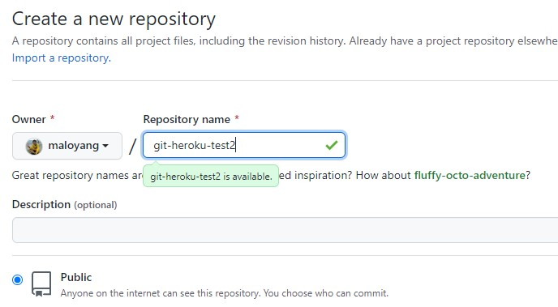
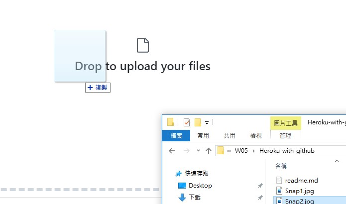
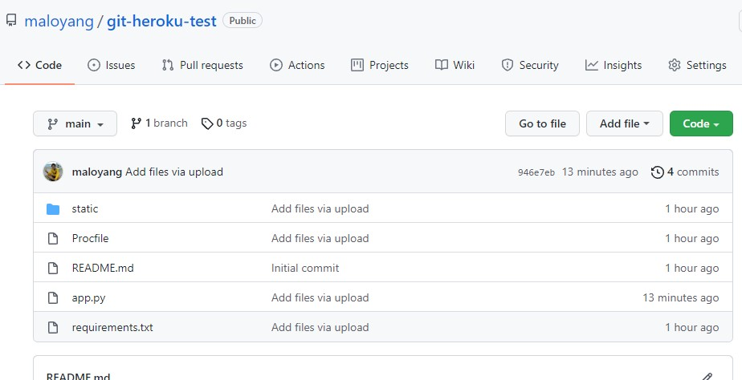
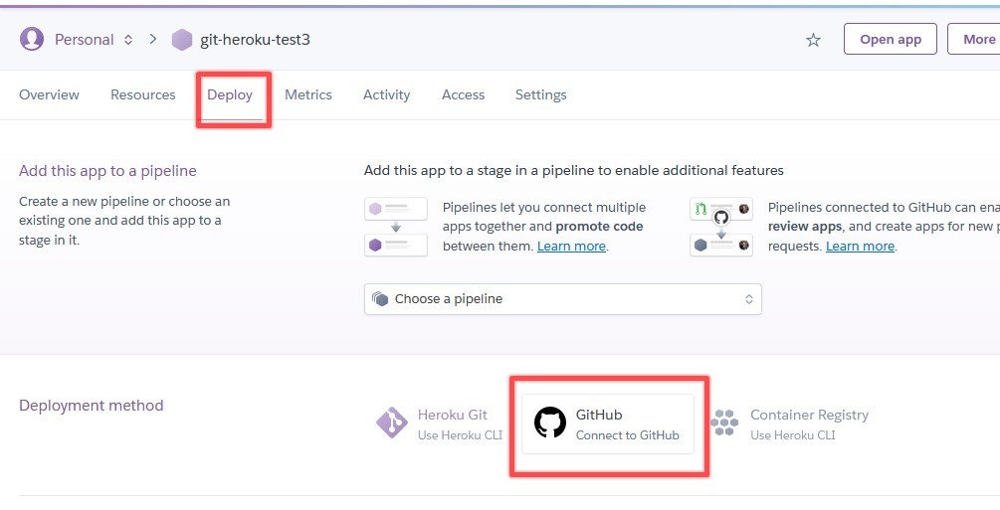
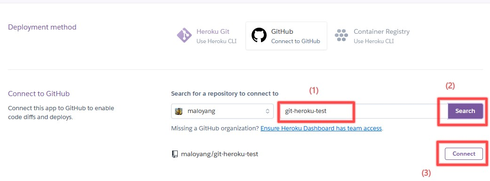
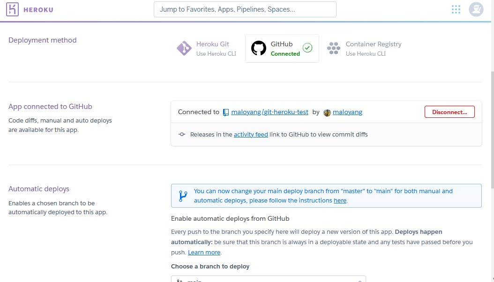
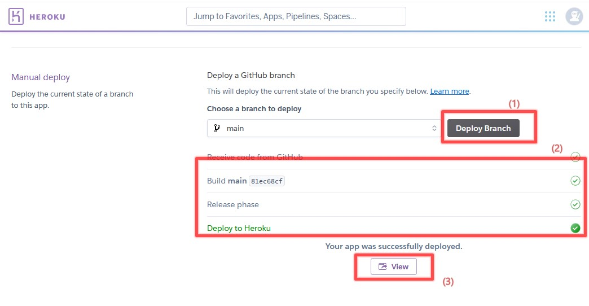
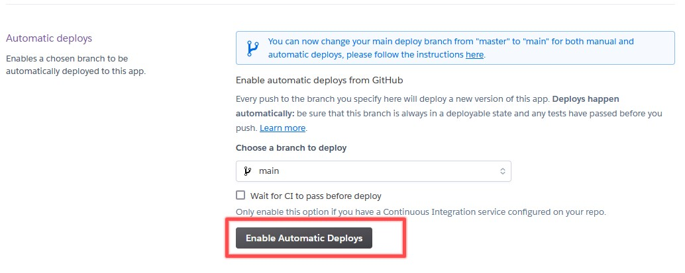
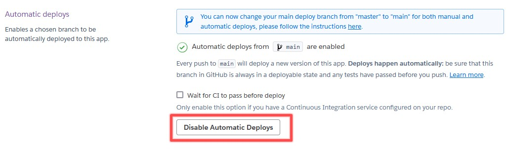
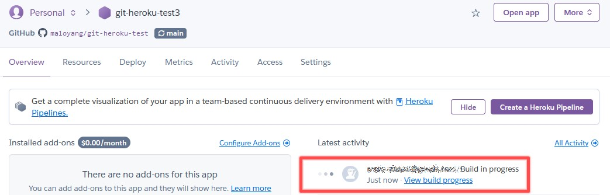

# Heroku with github
這邊介紹如何使用github來達成Heroku連續佈署! 
原來Heroku早就有另一個使用GUI介面就能佈署的工具，一直沒注意到，以為github也是用指令，heroku cli也是用指令....XD

## 使用方式

- 先到github申請一個帳號 [link](https://github.com/)

- 建立一個專案，如下

- 你如果不想用指令上傳檔案，在github這邊可以讓你使用拖拉的方式，進行檔案的上傳

- 我們先把一個網頁專案要用的東西都上傳上去，比如：上傳我們W04的map專案
    - <a href="https://github.com/maloyang/KH20210925_Python_Data_Science/tree/main/W04/flask-map-03" target="_blank">W04的map專案連結</a>
    - 以下為上傳的結果

----

## github的部份完成了，接著就是Heroku的部份了

- 建立一個新的APP專案

- 建立好後，進入專案中的"deploy"分頁，點「github」的圖示

- (1)輸入你剛剛在github建立的專案名稱，(2)點一下 Search，(3)點一下 connect

- 連結成功的畫面如下

## 接下來就可以開始佈署你的程式到Heroku上了

- 點一下這一頁最下面的 「Deploy Branch」，你會看到以下成功的畫面，再點一下「View」就可以看到你的程式畫面了
- 記得每一次更新程式到github上後，來這邊按一下這一個按鈕!!

## 連續自動佈署!!  懶人好工具

- 一樣的分頁下，有一個「Enable Automatic Deploys」的工具，按一下，打開功能

- 你會看到如下的畫面，表示自動佈署已打開
- 你也可以按一下 Disable 取消

- 當你上傳新的程式到github上時，你只要到「Overview」分頁就可以看到他是否佈署完成

